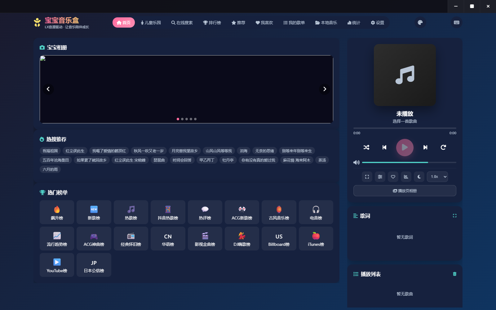
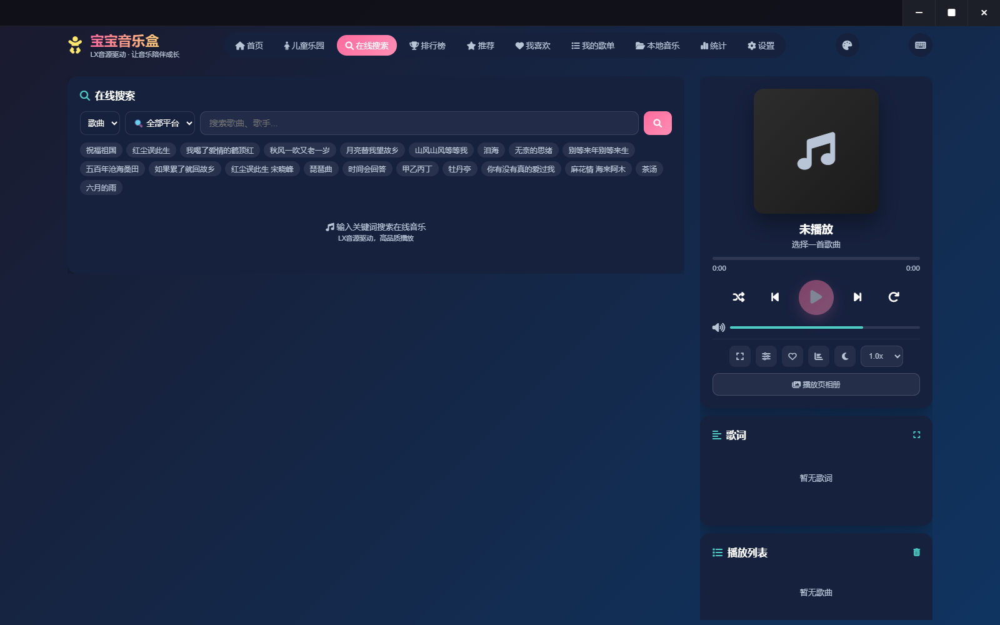
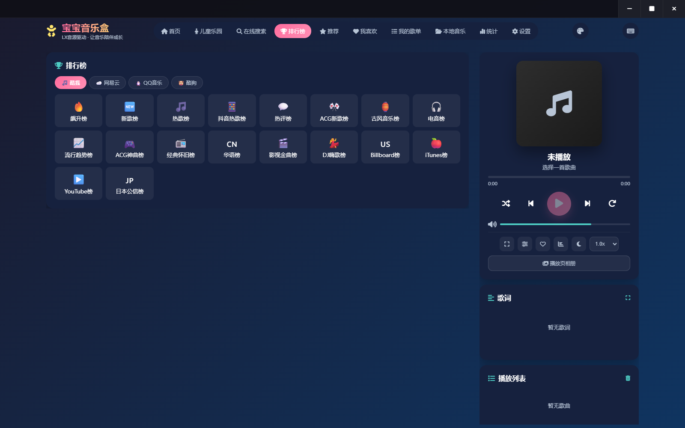
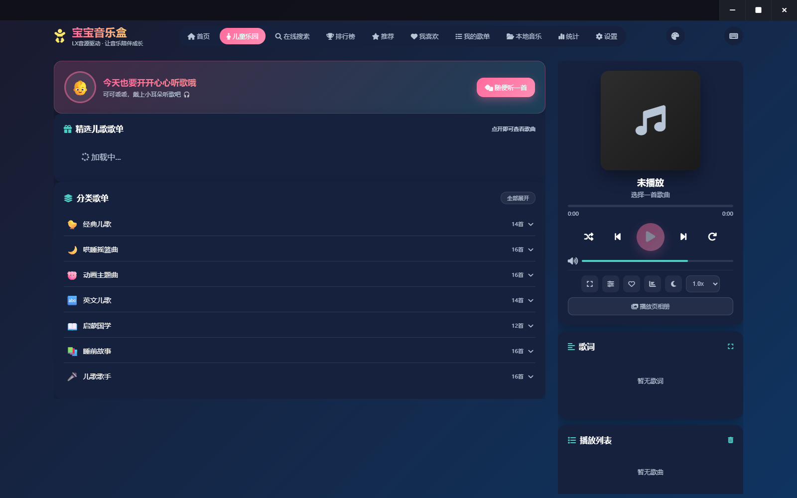
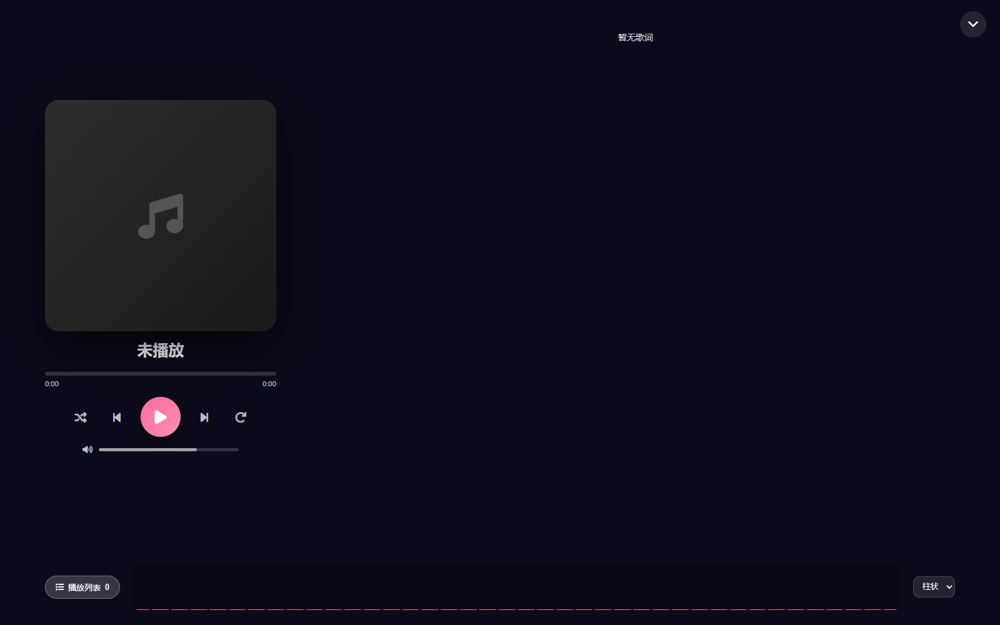
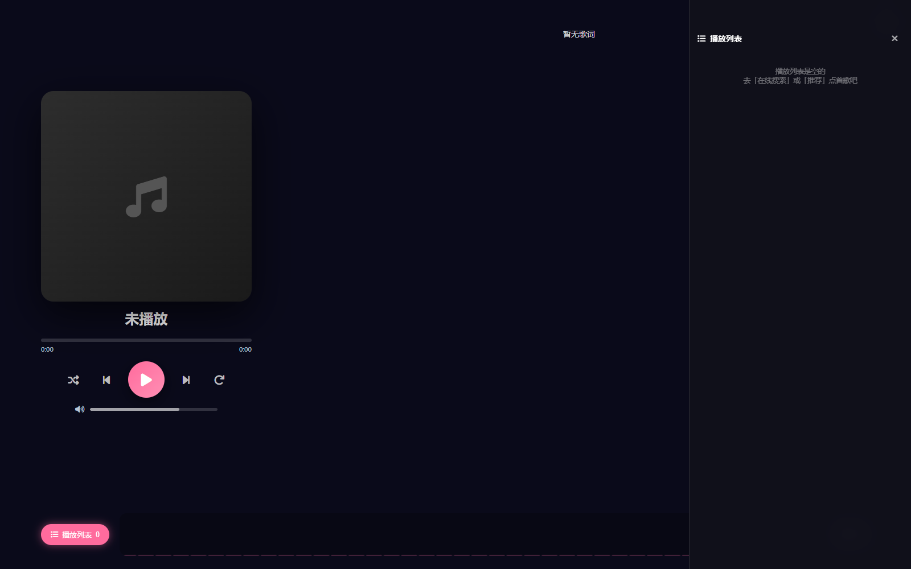
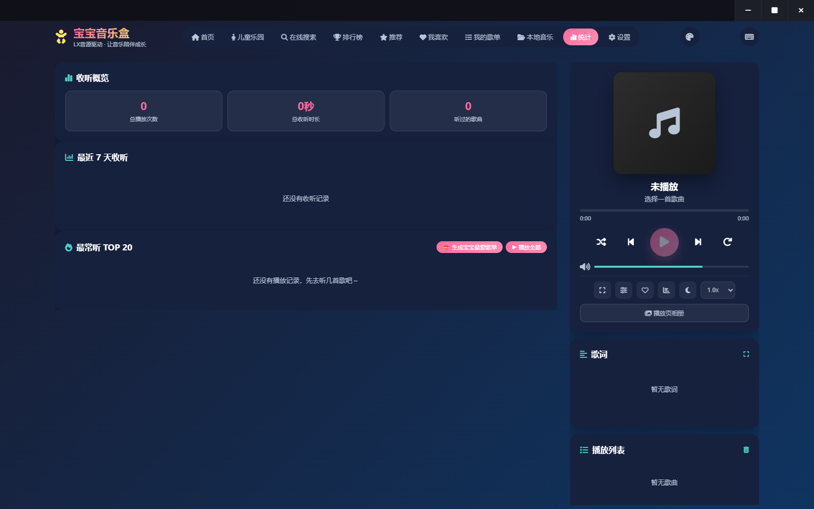
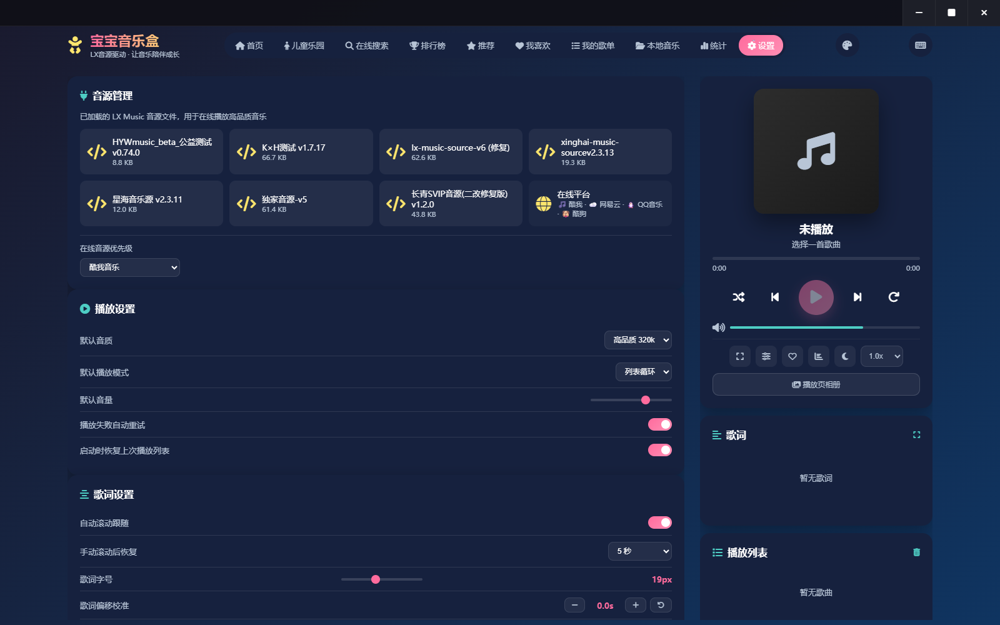

<div align="center">

# 宝宝音乐盒 · Baobao Music Box

**一个本地运行的家庭音乐播放器**
本地音乐 + 四平台在线搜索 + 宝宝照片轮播 + 儿歌专区

*不需要注册、不需要账号、不上传任何数据 —— 所有东西都在你自己的电脑里。*


[⬇️ 下载](#-下载与安装) · [🖼 界面](#-界面一览) · [✨ 功能](#-功能) · [⌨️ 快捷键](#️-快捷键) · [🔧 开发](#-开发)

<br/>



</div>

---

## ✨ 它是什么

给**有宝宝的家庭**做的播放器。既是正经的音乐播放器（多音源、均衡器、频谱、歌词），
又把家里的照片做成轮播，让屏幕在放音乐的时候也是一张家里的相框。

| | |
|---|---|
| 🎵 **四平台聚合** | 酷我 / 网易云 / QQ / 酷狗 —— 哪个平台播不了，自动跨源换源兜底 |
| 👶 **宝宝元素** | 首页照片轮播 + 儿童乐园（儿歌专区）+ 播放页相册 |
| 🔒 **完全本地** | 服务只监听 `127.0.0.1`，照片、歌单、统计全在本机，不联网上传 |
| 📦 **开箱即用** | 单个 exe 双击就跑，照片和音源都已打包进去，转发给家人即可 |

---

## 🖼 界面一览

<table>
<tr>
<td width="50%"><br/><sub><b>首页</b> · 宝宝相册轮播 + 儿歌快捷入口</sub></td>
<td width="50%"><br/><sub><b>在线搜索</b> · 四平台聚合检索</sub></td>
</tr>
<tr>
<td width="50%"><br/><sub><b>排行榜</b> · 137 个榜单，按平台 Tab 切换</sub></td>
<td width="50%"><br/><sub><b>儿童乐园</b> · 儿歌专区</sub></td>
</tr>
<tr>
<td width="50%"><br/><sub><b>全屏播放页</b> · 大封面 + 大歌词 + 频谱</sub></td>
<td width="50%"><br/><sub><b>播放队列</b> · 全屏内抽屉（快捷键 <code>Q</code>）</sub></td>
</tr>
<tr>
<td width="50%"><br/><sub><b>统计</b> · 收听时长 + 最常听 TOP20</sub></td>
<td width="50%"><br/><sub><b>设置</b> · 本地音乐 / 音源管理</sub></td>
</tr>
</table>

---

## 📥 下载与安装

| 平台 | 下载 | 说明 |
|------|------|------|
| **Windows** | [`baobao-music-box-v1.2.3-win64.exe`](../../releases) | 双击即用，免安装免 Python，约 32 MB |
| **Android** | [`baobao-music-box-v1.2.3-android.apk`](../../releases) | 侧载安装，Android 7.0+ |
| **源码** | `python app.py` | 需要 Python 3.8+ |

### 🪟 Windows

1. 从 [Releases](../../releases) 下载 exe
2. **双击运行** —— 直接弹出原生播放器窗口（Edge WebView2 内核，不是浏览器标签页）
3. 无边框自绘标题栏：**按住顶部深色条拖动窗口**，右上角三个按钮最小化/最大化/关闭，**双击标题栏**最大化还原

> 不需要装 Python，不需要装任何东西。
> 首次启动等 10–20 秒（PyInstaller 解包 + 杀软扫描），之后 3–4 秒。
>
> Windows SmartScreen 可能提示"未知发布者"（exe 未做代码签名）—— 选「仍要运行」即可。

### 🤖 Android

下载 APK，点开安装（需允许「安装未知来源应用」）。

> 安卓版把同一份 `server.py` 用 [Chaquopy](https://chaquo.com/chaquopy/) 跑在 APK 里，
> WebView 指向 `127.0.0.1:8082` —— **和 Windows 版共用同一套播放器代码**，行为一致。
> 构建走 GitHub Actions（本地不需要 Android SDK）。

### 💻 源码运行

```bash
python app.py            # 自动选端口 + 弹原生窗口
python server.py         # 只起服务，手动访问 http://localhost:8082/player.html
```

Windows 用户也可以双击 `启动音乐盒.bat` / `停止音乐盒.bat`。

---

## 🎯 功能

<table>
<tr><td width="50%" valign="top">

**🎵 多音源**
- 酷我 / 网易云 / QQ / 酷狗四平台搜索与播放
- 播不了自动**跨源换源**兜底
- 取链接三级降级：音源 API → 酷我直链 → 重试

**📚 音乐库**
- 首页推荐 · 在线搜索（分页）
- 排行榜（**137 个榜单**）
- 推荐歌单（106 个）· 歌单详情
- 儿童专区（7 个分类 + 精选歌单）

**🔀 平台切换**
- 榜单 / 推荐歌单 / 歌单搜索都按平台分 Tab
- 选哪个平台就只看哪个平台，选择会记住

**💾 本地**
- 选择文件 / 文件夹（记住授权）
- 拖拽导入 · 自动读时长

</td><td width="50%" valign="top">

**❤️ 个人**
- 我喜欢 · 我的歌单（新建/重命名/删除）
- 最近播放 · 播放统计
- 一键生成「宝宝最爱」

**🎛 播放**
- 10 段均衡器 · 倍速
- 频谱可视化（**6 种样式**：柱状/镜像/峰值/波形/点阵/圆环）
- 15 种主题色 · **壁纸皮肤（5 张）**
- 睡眠定时（15/30/45/60/90 分 + 播完本曲 + 淡出）

**📝 歌词**
- 多源自动回退 · 逐行高亮 · 全屏歌词
- **双语歌词配对高亮**（原文+译文一起亮）
- 点击跳转 · 字号/偏移可调

**📦 其他**
- 离线缓存（IndexedDB），无网可播
- PWA 可安装 · 歌单导入导出 · 全量备份/恢复

</td></tr>
</table>

---

## ⌨️ 快捷键

按 <kbd>?</kbd> 可在应用内查看全部。常用的几个：

| 键 | 作用 |
|---|---|
| <kbd>F</kbd> | 打开/关闭全屏播放页 |
| <kbd>Q</kbd> | 全屏播放页内 · 播放列表抽屉 |
| <kbd>L</kbd> | 收藏当前歌曲 |
| <kbd>Esc</kbd> | 分级返回（收抽屉 → 关全屏 → 歌单返回 → 关菜单） |
| <kbd>双击标题栏</kbd> | 最大化 / 还原窗口 |

---

## 📁 数据放在哪

**exe 旁边**（源码运行就是项目目录）—— 用户自己放文件，程序自动识别：

```
宝宝音乐盒.exe
photos/          ← 把宝宝照片丢这里，首页自动轮播（jpg/png/webp/gif）
音源/            ← 放你自己的洛雪/LX 音源 .js 文件
config.json      ← 配置音源密钥（可选，见下）
error.log        ← 出问题时自动生成，反馈时把它发出来
```

程序**优先用同级目录**的内容，找不到才用打包内置的那份。所以：

- 换成你自己的照片/音源，会覆盖内置的那份
- exe 里已经带了照片/音源，直接转发给别人即可开箱使用

---

## 🔑 在线播放与密钥

在线搜索、榜单、推荐、在线播放**全部开箱即用**，不需要配置任何东西。

音源接口对 320k 播放不校验密钥，所以公开分发的包里**不含任何第三方凭据**
（实测：不带密钥和带密钥，同一批歌都返回 200）。

如果你有自己的密钥想用上（例如更高音质），放 `config.json`：

```bash
cp config.example.json config.json
```

```json
{ "hyw_key": "你的密钥" }
```

也可以用环境变量 `MB_HYW_KEY=xxx`。自己私用想打进 exe：
`python build_exe.py --with-key`。

---

## 🏗 为什么是本地服务而不是纯网页

浏览器的音频跨域限制（CORS）会让在线音源无法播放，也无法用 Web Audio 做均衡器。
所以用一个小 Python 服务做三件事：

1. **代理音频请求**，补上 CORS 头和 Range 支持（拖动进度条、均衡器必需）
2. **聚合多个音源接口**，前端只调一个地址
3. **提供本地缓存和静态资源**

服务只监听 `127.0.0.1`，不对外网开放。所有数据都在你本机。

```
┌──────────────┐   http://127.0.0.1:8082   ┌────────────────────────────┐
│  原生窗口     │ ─────────────────────────▶ │  player.html（单文件前端）  │
│  WebView2    │                            │  均衡器 / 频谱 / 歌词 / UI │
└──────────────┘                            └──────────────┬─────────────┘
                                                           │ /api/*
                                              ┌────────────▼─────────────┐
                                              │  server.py（本地服务）    │
                                              │  ┌────────────────────┐  │
                                              │  │ 多音源聚合          │  │
                                              │  │ 酷我/网易云/QQ/酷狗 │  │
                                              │  └────────────────────┘  │
                                              │  ┌────────────────────┐  │
                                              │  │ 音频代理(补CORS)   │  │
                                              │  │ 歌词多源竞速       │  │
                                              │  └────────────────────┘  │
                                              └────────────┬─────────────┘
                                                           │ https
                                              ┌────────────▼─────────────┐
                                              │  上游音源 / CDN          │
                                              └──────────────────────────┘
```

---

## 🔧 开发

```bash
# 打包 exe
python build_exe.py                # 产物在 dist/
python build_exe.py --with-key     # 私用：把 config.json 打进去

# 自动化测试（需要 playwright + 本地 Chrome）
python tools/verify.py             # 27 项功能回归
python tools/verify_ui.py          # 无边框标题栏 / 歌单详情视图
python tools/verify_fs.py          # 全屏播放列表 + 6 种频谱样式
python tools/verify_pmap.py        # 并发超时/宽限期（5 项合成用例）
python tools/verify_winbar.py      # 标题栏两种模式（存根宿主 / 真浏览器）
python tools/verify_real_window.py # 真 pywebview 窗口内部 DOM 实况
python tools/stress.py             # 8 项压力测试（内存泄漏 / 竞态 / 边界输入）
python tools/shoot_readme.py       # 重新生成 README 配图
```

> **验收要看"可见性"而不只是"存在"**：DOM 断言 `exists=True` 照样可能是 `display:none`，
> `HTTP 200` 照样可能是空结果。所以有 `verify_real_window.py` ——
> 从真 pywebview 窗口内部读 `getComputedStyle` / `getBoundingClientRect`，这才是权威。
> 截图在高 DPI 机器上会抓到放大后的局部，只能当辅助。

### 目录结构

```
app.py                 exe 入口（选端口、开原生窗口、错误兜底）
server.py              本地服务（多音源聚合 + 音频代理 + 歌词多源竞速）
player.html            单文件前端（约 4400 行，10 个页面标签）
manifest.json / sw.js  PWA
build_exe.py           PyInstaller 打包脚本
tools/                 测试 / 预览 / 发版脚本
docs/images/           README 配图（入库）
docs/screenshots/      开发过程截图（不入库）
reference/             参考的开源项目（洛雪音源等）
archive/               历史原型与备份
音源/ wallpapers/      内置音源 .js / 壁纸图片
photos_web/            内置照片的压缩版（打包用）
android/               安卓工程（Chaquopy 复用 server.py）
```

### 发版

```bash
python tools/release.py            # 建 GitHub Release + 上传本地构建的 exe
```

> **exe 必须本地构建上传** —— CI 拿不到 `photos_web/`、`音源/`（不入库），
> 用 CI 构建的 exe 会缺照片和音源。
> APK 由 GitHub Actions 构建并自动挂到 Release（`android.yml`，版本号从 tag 推导）。

---

## ⚠️ 已知限制

- **歌词是逐行（LRC），不是逐字** —— 公开接口没有逐字歌词（yrc）数据，这是数据源限制
- **在线音源依赖第三方** —— 链接失效或被限流时会自动重试并跳过，但没法保证每首都可播
- **exe 未做代码签名** —— SmartScreen 提示"未知发布者"，选「仍要运行」即可
- **APK 未上架应用商店** —— 需要侧载安装

---

## 📄 许可

MIT —— 见 [LICENSE](LICENSE)

音源文件、音频内容版权归各自权利人，本项目不附带任何音源或音频内容。
